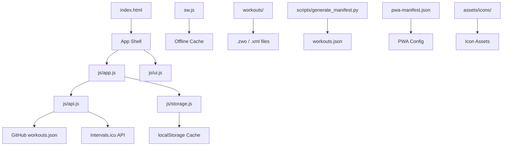

# Cycling Workout Generator - PWA

**Live app:** [http://tiny.cc/WorkoutGen](http://tiny.cc/WorkoutGen)  
A Progressive Web App for discovering cycling workouts and uploading them to Intervals.icu. Works offline, installs on mobile and desktop, and syncs with a GitHub-hosted workout library.

---

## Features

- Browse workouts fetched from a GitHub repository (workouts.json + .zwo/.xml files)
- Filter by duration, workout zone/type, and TSS (Training Stress Score)
- Download any workout file locally
- Upload workouts directly to Intervals.icu using your API key and athlete ID
- Works offline via Service Worker caching
- Auto-updates when new workouts are pushed to the repo

---

## Usage

1. Open the app (http://tiny.cc/WorkoutGen)
2. Use the filters to narrow results:
   - Duration - Less than 30 min, 30-45 min, 45-60 min, 60-90 min, or Greater than 90 min
   - Workout Type (Zone) - Filter by primary zone
   - TSS Range - Set min/max Training Stress Score
3. Click Search to apply filters
4. Click Surprise Me for a random workout
5. Click Reset to clear filters
6. On any result card:
   - Download - saves the .zwo/.xml file locally
   - Upload to Intervals.icu - sends the workout to your Intervals.icu account (requires API key + athlete ID in Settings)

---

## How It Works

### Architecture

### Data Flow

1. App loads workouts.json from GitHub (js/api.js)
2. StorageManager caches it in localStorage
3. User filters -> app.filterWorkouts() updates the grid
4. Download: fetches .zwo/.xml from GitHub, creates Blob, triggers download
5. Upload: fetches file content, base64-encodes it, POSTs to intervals.icu/api/v1/athlete/{id}/events
6. Service Worker caches assets for offline use

---

## Installation

### Mobile (iOS / Android)

1. Open http://tiny.cc/WorkoutGen in Safari (iOS) or Chrome (Android)
2. iOS Safari: Tap Share -> Add to Home Screen
3. Android Chrome: Tap menu (three dots) -> Add to Home Screen or Install App
4. Launch from home screen - it opens in standalone mode (no browser chrome)

### Desktop (Chrome / Edge)

1. Visit http://tiny.cc/WorkoutGen
2. Click the install icon in the address bar (or menu -> Install Cycling Workout Generator)
3. The app launches as a standalone desktop window

---

## Setup / Deployment (Self-Host)

### Prerequisites

- Python 3.7+ (for manifest generation)
- A GitHub account and repository
- (Optional) Intervals.icu API key + athlete ID for uploads

### Quick Start

1. Copy files to your repo root:
   - index.html, pwa-manifest.json, sw.js
   - css/, js/, assets/icons/, workouts/
   - scripts/generate_manifest.py, .github/workflows/update-manifest.yml

2. Configure GitHub URL in js/api.js (line ~6):
   this.GITHUB_BASE = https://raw.githubusercontent.com/YOUR_USERNAME/YOUR_REPO/main;

3. Add workout files to workouts/ (subfolders become categories):
   workouts/
   Endurance/
       LongRide.zwo
   HIIT/
       VO2MaxIntervals.zwo

4. Generate manifest (manual or via GitHub Actions):
   python scripts/generate_manifest.py
   This creates workouts.json.

5. Enable GitHub Pages (recommended):
   - Repo Settings -> Pages -> Source: Deploy from branch main -> Folder: / (root)
   - URL: https://yourusername.github.io/WorkoutGenerator/

6. Install the PWA from that URL (see Installation above).

---

## Intervals.icu Integration

To upload workouts:

1. Open the app -> click Settings (gear icon)
2. Enter your Intervals.icu API Key and Athlete ID
3. Click Save
4. Search for a workout -> click Upload to Intervals.icu

The upload sends the .zwo/.xml file as a base64-encoded event to Intervals.icu.

---

## Offline Support

- The Service Worker (sw.js) caches index.html, CSS, JS, icons, and workouts.json
- Once installed, the app works without an internet connection (cached workouts only)
- New workouts appear when you reconnect and refresh

---

## File Reference

| File / Folder | Purpose |
| index.html | App entry point |
| pwa-manifest.json | PWA configuration |
| sw.js | Service Worker (offline caching) |
| css/style.css | App styling |
| js/app.js | Main application logic |
| js/api.js | GitHub + Intervals.icu API |
| js/storage.js | localStorage manager |
| js/ui.js | UI rendering |
| workouts/ | Workout source files |
| workouts.json | Generated workout index |
| assets/icons/ | PWA icons |
| scripts/generate_manifest.py | Manifest generator |
| .github/workflows/update-manifest.yml | Auto-update workflow |

---

## Credits

Built for the cycling community. Workout files are user-provided; the app is a delivery mechanism.
